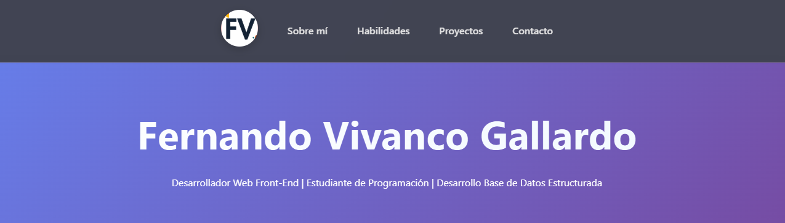
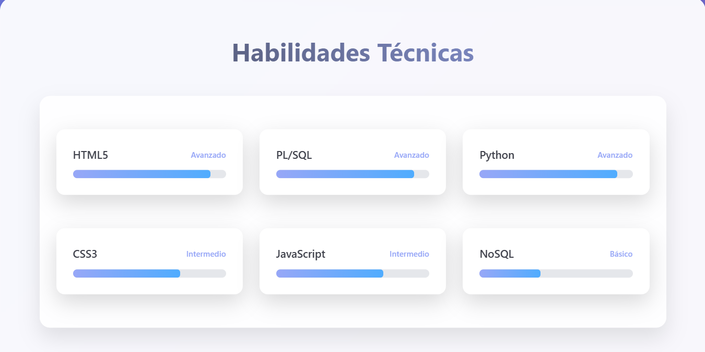

# Portafolio Personal - Fernando Vivanco

## 📋 Descripción
Portafolio web profesional de un estudiante de Analista Programador en INACAP. Demuestra habilidades en **HTML5 semántico**, **CSS3 avanzado** (Flexbox, Grid, Responsive), JavaScript interactivo y diseño moderno. Proyecto para evaluación Desarrollo Web Front-End (Yasna León Foitzick).

## ✨ Características
- **Single Page Application** con navegación por anclas.
- Secciones: Hero, Sobre mí (foto/tabla/bio), Habilidades (gráficos + soft-skills), Proyectos (galería Grid), Contacto (form validado), Footer.
- **Responsivo** (mobile/tablet/desktop).
- **Interactivo**: Copiar teléfono, animaciones skill-bars.
- Imágenes locales optimizadas.

## 🛠️ Tecnologías Usadas
| Frontend | Herramientas | Backend/Extras |
|----------|--------------|----------------|
| HTML5 | CSS3 Flexbox/Grid | JavaScript Vanilla |
| Semántica | Animaciones CSS | Git/GitHub |

## 📱 Demo
Abrir `portafolio.html` en Chrome/Firefox. Responsive en dispositivos ≥320px.

## 🚀 Instalación
1. Clonar repo: `git clone [URL-REPO]`
2. Abrir `portafolio.html` en browser.

## 📂 Estructura Archivos
```
Ev 1/
├── portafolio.html     # Página principal
├── portafolio.css      # Estilos externos
├── Fv.png              # Logo/foto personal
└── Python-logo-notext.svg.png # Imagen proyectos
```

## 📈 Commits (5 realizados)
- feat: navbar y estructura inicial
- feat: sección sobre mí
- feat: habilidades y final
- style: "Rapido" Ajustes de codigo para rúbrica
- style: README.md + agregados

## 📸 Capturas
  
  

## ✉️ Contacto
fernando.vivanco08@outlook.com | +56 9 1021 0637

© 2024 Fernando Vivanco Gallardo

